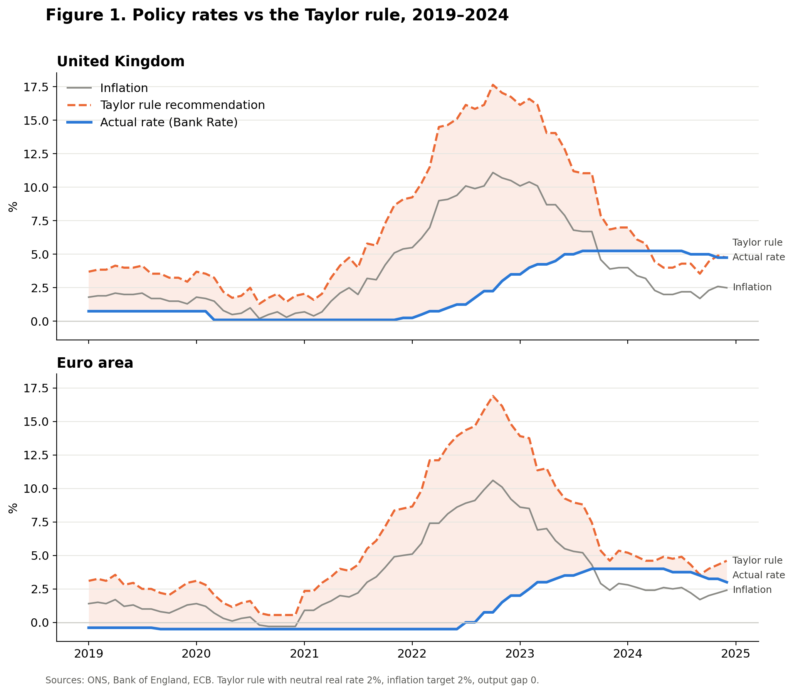

# Behind the Curve? Bank of England and ECB Interest Rates vs the Taylor Rule (2019–2024)

An empirical comparison of UK and euro area monetary policy during the 2021–23 inflation surge. It measures how far, and for how long, each central bank's policy rate fell short of the rate implied by the Taylor rule.



## Research question

Did the Bank of England and the European Central Bank raise interest rates later and by less than a standard monetary policy rule recommended? If so, does that reflect a policy error or a limitation of the rule itself?

## Key findings

- **Both central banks set rates far below the Taylor rule.** At the October 2022 inflation peak, the rule implied a UK policy rate of about 17.6%, against an actual Bank Rate of 2.25%, a shortfall of 15.4 percentage points.
- **Real interest rates were deeply negative.** With UK inflation at 11.1% and Bank Rate at 2.25%, the real policy rate was about −9% in October 2022.
- **The Bank of England moved first.** It began raising rates in December 2021; the ECB did not raise its deposit rate until July 2022.
- **The result is robust.** Lowering the assumed neutral real rate from 2% to 0.5% leaves a shortfall of more than 13 percentage points.
- **Interpretation.** Much of the inflation came from an energy supply shock that interest rates cannot directly address, so following the rule mechanically would likely have caused a severe recession. The persistence of deeply negative real rates into 2022–23, however, suggests both banks were slow to respond once inflation spread beyond energy.

The full methodology, results and discussion are in the notebook.

## Method

The Taylor rule (Taylor, 1993):

```
i = r* + π + 0.5(π − π*) + 0.5y
```

- r* = 2% (0.5% in the robustness check)
- π* = 2%
- output gap y = 0

The rule is applied month by month and compared with each central bank's actual policy rate.

## Data

| Series | Source |
|---|---|
| UK CPI inflation, annual rate (D7G7) | Office for National Statistics |
| Bank Rate (IUDBEDR) | Bank of England |
| Euro area HICP inflation, annual rate | European Central Bank Data Portal |
| ECB deposit facility rate | European Central Bank Data Portal |

The notebook downloads all data directly from the official APIs when it runs.

## Repository contents

| File | Description |
|---|---|
| `taylor_rule_analysis.ipynb` | Full analysis: data collection, model, results, robustness check and discussion |
| `taylor_rule_chart.png` | Figure 1: policy rates vs the Taylor rule |
| `requirements.txt` | Python dependencies |


## Limitations and further work

- Include official output gap estimates rather than assuming zero.
- Compare results using core inflation (excluding energy and food).
- Use a forward-looking rule based on inflation forecasts to account for policy lags.
- Apply the rule to individual euro area economies such as Germany.

## Acknowledgements

Code developed with the assistance of an AI coding tool. The research question, interpretation and conclusions are my own.

## Author

Nikhil, Year 12, studying Economics, Mathematics, Further Mathematics and Physics.
